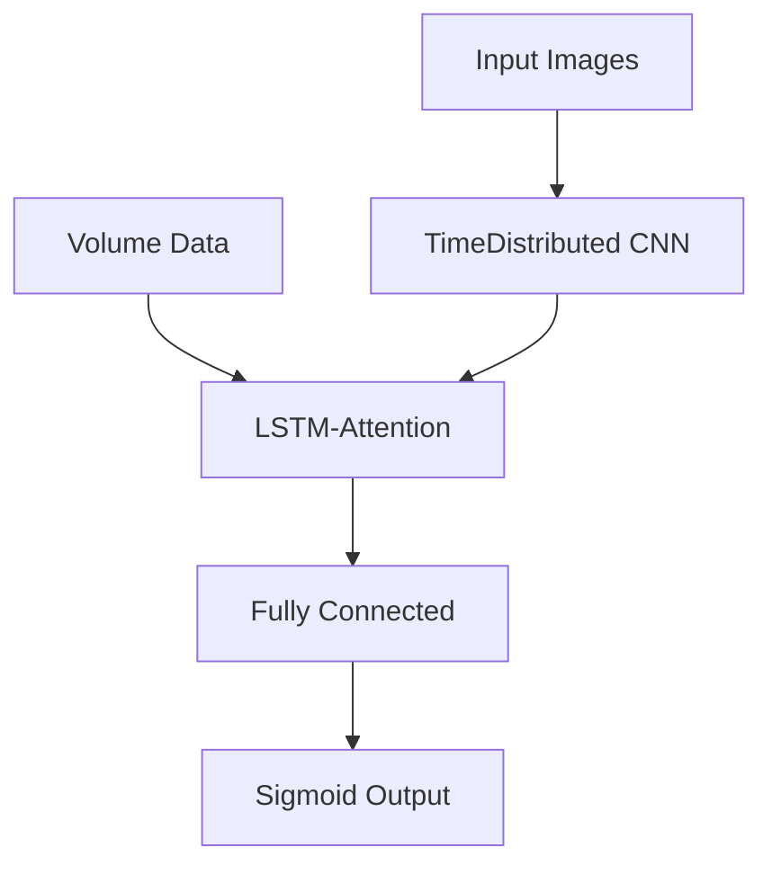

# **Blenns Architecture Model**  
*Blended Neural Networks for Candlestick Pattern Prediction*  
Blenns Library 📈
AI-Powered Stock Market Prediction with Candlestick Pattern Recognition

---

## **Table of Contents**  
1. [Overview](#overview)  
2. [Key Features](#key-features)  
3. [Installation](#installation)  
4. [Full Functionality Mode](#full-functionality-mode)  
5. [Limited Functionality Mode](#limited-functionality-mode)  
6. [Model Architecture](#model-architecture)  
7. [Troubleshooting](#troubleshooting)  
8. [License](#license)  

---

## **Overview**  
Blenns is an advanced deep learning framework that predicts next-day candlestick patterns by analyzing:  

🟢 **OHLC Images** (Open-High-Low-Close) processed as 64x64 RGB matrices  
📊 **Trading Volumes** integrated as auxiliary input channels  
🧠 **Hybrid CNN-LSTM-Attention** architecture for spatiotemporal pattern recognition  

---

## **Key Features**  

| Feature | Full Mode | Limited Mode |  
|---------|----------|-------------|  
| Custom Model Training | ✅ | ❌ |  
| Pre-trained Predictions | ✅ | ✅ |  
| Candlestick Visualization | ✅ | ✅ |  
| ROC Curve Analysis | ✅ | ❌ |  
| Training Metrics | ✅ | ❌ |  
| Execution Time | 2-5 mins | <30 secs |  

---

## **Installation**  

### **1. Google Colab (Recommended)**  
```python
!git clone https://github.com/DataScienceCoach/BlennsLib
%cd BlennsLib
!pip install -r requirements.txt
!pip install .
```

### **2. Local Python Environment**  
```bash
git clone https://github.com/DataScienceCoach/BlennsLib.git
cd BlennsLib
pip install -r requirements.txt
pip install .
```

---

## **Full Functionality Mode**  
*For complete model training and evaluation*  

```python
%matplotlib inline
import matplotlib.pyplot as plt
from sklearn.metrics import confusion_matrix, classification_report
from blenns.model import BlennsModel
from blenns.utils import (encode_candle_chart, 
                        display_first_two_images,
                        plot_training_validation_loss,
                        plot_roc_curve,
                        plot_predicted_candlestick_image)

# Initialize model
bm = BlennsModel()
data = bm.fetch_data("NVDA")  # Example: NVIDIA stock

# 1. Visualize input patterns
plt.figure(figsize=(12,4))
encoded_images, _ = encode_candle_chart(data)
display_first_two_images(encoded_images)
plt.show()

# 2. Train model (10-50 epochs recommended)
bm.train(data, epochs=10)

# 3. View training metrics
plot_training_validation_loss(bm.history)
plt.show()

# 4. Evaluate performance
plot_roc_curve(bm.model, bm.X_test_img, bm.X_test_vol, bm.y_test)
plt.show()

# 5. Prediction with visual
prediction = bm.predict_next_day()
plot_predicted_candlestick_image(bm.X_test_img[:1])
plt.show()
```

**Outputs:**  
- First 2 candlestick patterns  
- Training/validation loss curves  
- ROC curve analysis  
- Confusion matrix & classification report  
- Predicted candlestick visualization  

---

## **Limited Functionality Mode**  
*For quick predictions without training*  

```python
%matplotlib inline
from blenns.model import BlennsModel
from blenns.utils import plot_predicted_candlestick_image

# Initialize with pre-trained weights
bm = BlennsModel(pretrained=True)  # Critical parameter

# Fetch data and predict
data = bm.fetch_data("AAPL")  # Apple stock example
prediction = bm.predict_next_day()

# Visualize prediction
plot_predicted_candlestick_image(bm.X_test_img[:1])
plt.show()
```

**Advantages:**  
⚡ No training required  
🖼️ Immediate candlestick visualization  
📉 Works with any US stock ticker  

---

## **Model Architecture**  



**Technical Specifications:**  
- **CNN Layers**: 2x (Conv2D + MaxPooling)  
- **LSTM Units**: 50 with Attention mechanism  
- **Output Activation**: Sigmoid (0=Bearish, 1=Bullish)  
- **Input Shape**: (1, 64, 64, 3) for images + (1,) for volume  

---

## **Troubleshooting**  

| Error | Solution |  
|-------|----------|  
| `ModuleNotFoundError` | Run `!pip install --force-reinstall .` |  
| Plots not showing | Add `%matplotlib inline` and `plt.show()` |  
| CUDA errors | Restart runtime and check GPU availability |  
| Shape mismatches | Verify `data.shape == (N, 64, 64, 3)` |  

---

## **License**  
MIT License - Free for academic and commercial use  

**Repository**: [github.com/DataScienceCoach/BlennsLib](https://github.com/DataScienceCoach/BlennsLib)  

[](https://colab.research.google.com/github/DataScienceCoach/BlennsLib/blob/main/examples/demo.ipynb)  

---
**Disclaimer**: Predictions are for research purposes only. Past performance ≠ future results.
